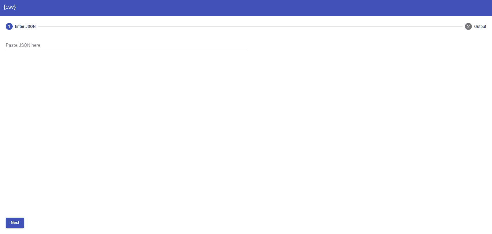

# JsonCsvWebApp
[](https://www.npmjs.com/package/json-csv-tool)

[](https://www.codefactor.io/repository/github/rogue-elephant/json-csv-web-app/issues)


## Try me out!
[](https://gitpod.io#snapshot/fefdc08c-4812-4d24-a827-1d18bde8b8b2)


Uses [json-csv-tool](https://www.npmjs.com/package/json-csv-tool) to convert Json (with options) into a rendered table (and at some point ability to download csv).



# Running the App
1 - Make sure you have docker installed on your machine.

2 - Clone the repo and cd to tthe project root.
```docker build -t json-csv-web-app:dev .```

3 - Once this has built the image you can then run:
```docker run -it -p 4201:4200 -v ${PWD}:/app --rm json-csv-web-app:dev```

4 - Once the angular app is running go to http://localhost:4201/

This project was generated with [Angular CLI](https://github.com/angular/angular-cli) version 8.3.17.

## Development server

Run `ng serve` for a dev server. Navigate to `http://localhost:4200/`. The app will automatically reload if you change any of the source files.

## Code scaffolding

Run `ng generate component component-name` to generate a new component. You can also use `ng generate directive|pipe|service|class|guard|interface|enum|module`.

## Build

Run `ng build` to build the project. The build artifacts will be stored in the `dist/` directory. Use the `--prod` flag for a production build.

## Running unit tests

Run `ng test` to execute the unit tests via [Karma](https://karma-runner.github.io).

## Running end-to-end tests

Run `ng e2e` to execute the end-to-end tests via [Protractor](http://www.protractortest.org/).

## Further help

To get more help on the Angular CLI use `ng help` or go check out the [Angular CLI README](https://github.com/angular/angular-cli/blob/master/README.md).
